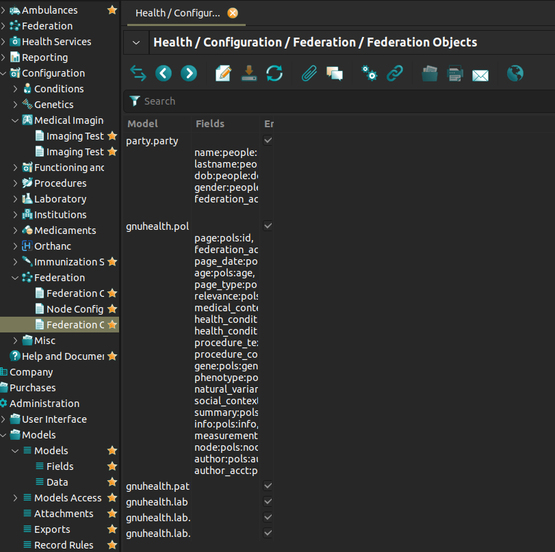
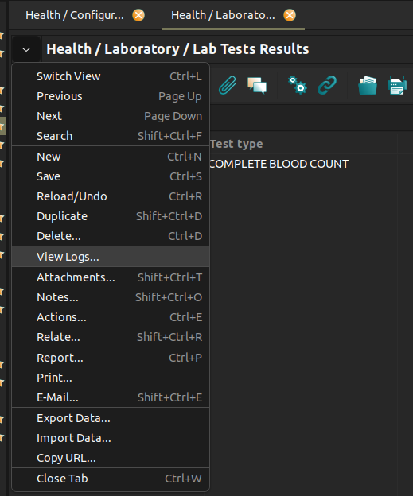
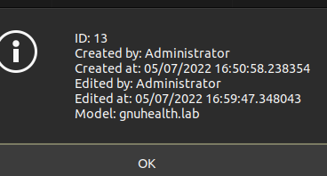
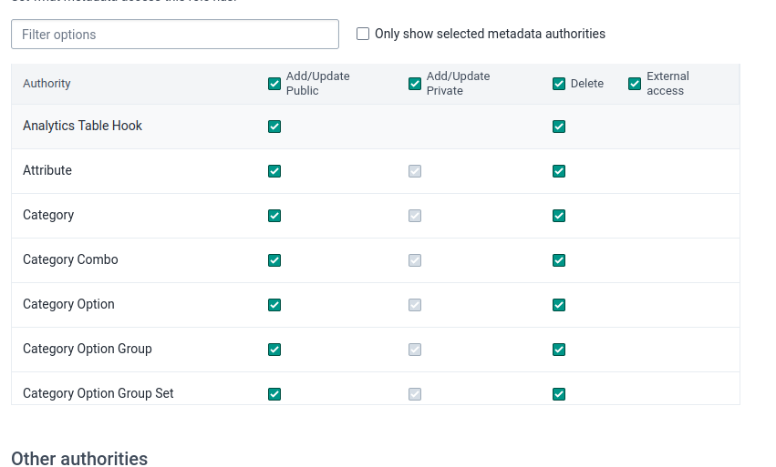

<!-- 
###########################################################
##                                                       ##
##             Readme Template by: @YassirH9             ##
##                                                       ##
###########################################################
-->
<a name="readme-top"></a>


<!-- PROJECT -->
<br />
<div align="center">
  <h3 align="center">ETL Sample With GNU-Health and Dhis2</h3>

  <p align="center">
    OpenDX28
    <br />
    <br />
  </p>
</div>

<!-- ABOUT THE PROJECT -->
## About The Project

This repository is intended to lay some development foundations as an example to start an ETL process in which `GNU-Health` is used as data source and `Dhis2` as destination.

<p align="right">(<a href="#readme-top">back to top</a>)</p>

<!-- DEV NOTES -->
## Dev Notes

* This repo is based in `Sierra Leone` Image of `GNU-Health`
  * If you aren't using this Image please change all `Sierra Leone` rootOrgUnit vars for the instance that you are using.
  
### Extra features

* This script has implemented a change log method used to keep a record of all methods used and their responses the logs can be found in the directory "logs/log[date].txt.

<p align="right">(<a href="#readme-top">back to top</a>)</p>

### Built With

This project was made with following tech-stack.

* Proteus 6.8.0 
* Python 3.10.6
* Dhis2 2.37.1.2
* GNU-Health 

<p align="right">(<a href="#readme-top">back to top</a>)</p>


<!-- GETTING STARTED -->
## Getting Started

For the proper use of this repo you should had installed the following pip libraries and have a instance of `GNU-Health` and `Dhis2` in docker.

<!-- PREREQUISITES-->
### Prerequisites

* proteus
  ```sh
  pip install proteus
  ```
* statistics
  ```sh
  pip install statistics
  ```

<!-- INTALLATTION-->
### Installation

You should change the following conection info if you arent usining a sample data.   

1. GNU-Health connection data
  ```python
  """
  Server conf
  """
  user = 'exampleuser'
  password = "examplepassword"
  dbname = "exampledbname"
  hostname = 'localhost'
  port = '8000'
  health_server = 'http://'+user+':'+password+'@'+hostname+':'+port+'/dbname+'/'
  conf = config.set_xmlrpc(health_server)
  ```
2. Dhis2 connection data
  ```python
  def login():
    session = requests.Session()
    session.auth = ('username', 'password')
    return session
  ```

<p align="right">(<a href="#readme-top">back to top</a>)</p>


<!-- USAGE EXAMPLES -->
## Usage

The best use for this script is to extract information from gnu-health to perform some process with it and integrate it in dhis dimensions, however this example is based on the gnu-health labs model and as a working sample it works well to show how everything moves behind.

To extend the following example using the lab module, I recommend changing the analyte to see the results shown by the script, or venture to change the model and query other gnu-health modules.

Note: The module has to be externalized in client side of gnu-health, that can be made following this easy steps.
* In the visual client of GNU-Health go to /Federation/Federation Object
* Add a new entrace putting the name exactly of the model that you want to externalice (now that model is accessible from the API)

<p align="center">
  
</p>

* To find the name of the model in the client go to any part of the client that you want to take access externaly and access to "view logs" menu

<p align="center">
  
  
</p>

* To upload all the data obtained in GNU-Health just remember, the admin user of Dhis2 doesn't have the proper authorities to upload data, to change that you need go to User section and select role management then find the superuser role and asing the following authorities

<p align="center">
  
</p>

<p align="right">(<a href="#readme-top">back to top</a>)</p>


<!-- CONTACT -->
## Contributors

Github - [@yassirH9](https://github.com/yassirH9)


<p align="right">(<a href="#readme-top">back to top</a>)</p>


<!-- ACKNOWLEDGMENTS -->
## Acknowledgments

Useful documentation used in this project.

* [Dhis2 documentation](https://docs.dhis2.org/en/develop/using-the-api/dhis-core-version-239/introduction.html)
* [Dhis2 Dev documentation](https://docs.dhis2.org/archive/en/2.25/developer/html/dhis2_developer_manual.html)
* [Gnu-Health documentation portal](https://www.gnuhealth.org/docs/)


<p align="right">(<a href="#readme-top">back to top</a>)</p>


